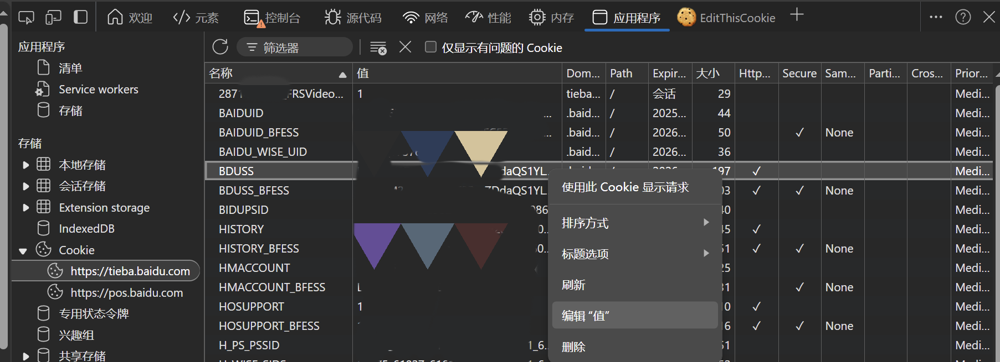

# 贴吧管理 bot 使用手册

version: 1.4.0+20250811

[TOC]

------

## 简介

欢迎使用贴吧管理 bot，本 bot 旨在为吧主和各位吧务在吧务群内提供一种指令清晰、交互方便的贴吧管理方式，功能包括但不限于封禁拉黑等基础吧务操作、循封管理、申诉推送与处理、信息查询与录入等。

## 开始使用

### 用户协议

在使用本 bot 之前，请确保您已经阅读并同意了以下协议：

1. 本 bot 仅收集必要的信息以提供和改进本 bot 的基础功能，包括但不限于：群聊 ID 与用户 ID 、操作日志、报错信息；

2. 为了实现相关吧务操作，需要您主动通过指令添加吧务和吧主账号的 BDUSS，BDUSS 是您的账号凭证，使用 BDUSS 可以进行大部分的贴吧账号操作，请您谨慎添加；

3. 为了实现关联数据查询功能，本 bot 将会存储您通过本 bot 对相关贴吧用户的操作，并在另外征得您明确授权的情况下向其他用户提供查询；

4. 除非法律要求或您明确同意，否则您的信息将不会被共享给第三方；

5. 本 bot 收集的所有数据将安全存储在 bot 管理员的个人服务器上，并采取合理措施防止未经授权的访问、泄露或篡改；

6. 您可以随时通过指令或联系 bot 管理员查询、更改或删除您的数据。

### 前置信息

在开始使用之前，您需要了解以下信息：

#### BDUSS

`BDUSS` 是包括贴吧在内的百度系网站的一种账号凭证。为了使用本 bot 的大部分贴吧管理和查询功能，需要通过[设置BDUSS指令](#设置bduss)提供吧主和一名吧务的 `BDUSS`。

以 Edge 浏览器为例（Chromium 内核浏览器通用），`BDUSS` 的获取方法如下：

1. 打开贴吧首页(`tieba.baidu.com`)，确认账号已登录并打开开发者工具（`F12`）；

2. 在开发者工具中切换到 `应用程序` （或类似中文/英文名称）选项卡，展开 `存储` -> `Cookie` -> `tieba.baidu.com`；

3. 在 Cookie 中找到名称为 `BDUSS` 的项，该项的值为长度192位的包含大小写字母与数字的字符串；

4. 右键选择 `编辑“值”` ，再次右键选择 `复制` ，即可获得 `BDUSS`。



您也可以点击地址栏左侧的 `锁` 图标，选择 `Cookie 和站点数据`，在 `tieba.baidu.com` 中找到 `BDUSS` 的值。

您同样可以选择使用 `Cookie-Editor`、 `EditThisCookie` 等浏览器插件来更方便地获取 `BDUSS`。

通常情况下，`BDUSS` 的有效期很长。在获取 `BDUSS` 后，您在浏览器中手动退出登录，或在贴吧app、百度app注销您的登录，`BDUSS` 将会失效。

#### 贴吧用户身份标识

##### 贴吧ID

`贴吧ID` 是贴吧用户在贴吧客户端中的一种不可变唯一标识，直接从用户主页点击复制即可获取形如 `@XXX@给你分享了贴吧号#1234567890#整段复制后打开贴吧即可找到Ta` 的字符串，十分方便。故本 bot 绝大部分对用户的操作都以 `贴吧ID` 作为参数。

任何使用过新版贴吧手机客户端的贴吧用户都会被系统分配一个 `贴吧ID`。不过，有时候我们会遇到一些从未使用过新版贴吧手机客户端的账号，这些账号是没有 `贴吧ID` 的。

##### 用户名

`用户名` 是贴吧用户的一种可变唯一标识，可以在百度APP中手动修改。我们可以在用户资料页中看到用户名。相较于 `贴吧ID`，`用户名` 为空的情况更加常见。

> [!NOTE]
>
> 注意：`用户名` 与 `昵称` 不同，虽然它们都是一种唯一标识，但我们无法通过 `昵称` 来对某用户进行吧务操作。
> 在吧务后台中，我们通常需要使用 `昵称` 或 `用户名` 来查询操作记录。

##### 头像ID/Portrait

`Portrait` 是贴吧用户的一种不可变唯一标识，形如 `tb.1.81d861cb.OdTTVyaQZgMA73YK9x63bQ`。它是贴吧用户的头像地址，具有非空、全局唯一、不可更改的特点。在贴吧网页版中，可以在用户主页 URL 中找到；在贴吧客户端中，可以在用户主页右上角点击举报并复制链接获取。

当遇到 `贴吧ID` 和 `用户名` 为空的情况，我们通常使用 `Portrait` 来唯一确定一个用户。

##### 用户ID/user_id

`user_id` 也是贴吧用户的一种不可变唯一标识，同样具有非空、全局唯一、不可更改的特点，但获取较为麻烦。通常本 bot 会将 `贴吧ID` 转换为 `user_id` 来进行吧务操作。

#### 关联信息

`关联信息` 是本 bot 的重要功能。当您通过本 bot 对某用户执行吧务操作时，本 bot 将自动记录这些操作。

关联信息还可以通过[添加关联信息](#添加关联信息)指令手动录入，通过[查询关联信息](#查询关联信息)指令查询。

> [!NOTE]
>
> 在添加关联信息时，bot 将会自动检查该用户是否更改过昵称或用户名。若有，将会记录该用户的曾用名。

默认情况下，关联信息仅供录入者所在吧群查询。管理员可以通过[公开关联信息](公开关联信息)指令将特定用户或本吧记录的所有关联信息设为公开。

当某用户在某个吧的关联信息被公开后，其他吧的用户可以通过[查询关联信息](查询关联信息)指令查询到该用户的关联信息。

#### 权限等级

- **群主**(owner)：当前群未初始化时，拥有初始化的权限；
- **吧主**(master)：拥有分配权限、加精、置顶、推荐上首页、删除吧内发言、重置和管理员、吧务的所有权限；
- **管理员**(admin)：拥有拉黑、循封管理和吧务的所有权限；
- **吧务**(moderator)：拥有删贴、封禁、处理申诉的权限；
- **普通用户**(user)：拥有各种查询操作权限。

初始化后，需要手动为群内用户分配权限等级。下方的指令列表中将会标注每个指令所需的最低权限等级。

#### 指令头/命令头

在使用指令时，需要在指令前添加以下任意一种前缀：

- `/`：斜杠
- `、`：中文（全角）顿号
- `.`：英文（半角）句号
- `!`：英文（半角）感叹号
- `！`：中文（全角）感叹号

未添加前缀的指令将被 bot 忽略。

在本手册中，我们将使用 `/` 作为指令头示例。在实际使用时，您可以根据自己的习惯选择其他指令头。

例如：

```shell
/初始化 明日方舟吧
、初始化 明日方舟吧
.初始化 明日方舟吧
!初始化 明日方舟吧
！初始化 明日方舟吧
```

> [!IMPORTANT]
>
> 注意：所有指令**无需通过艾特 bot 起手**。

#### 指令格式

通常，指令的格式如下：

```shell
/指令名 [参数1] [参数2] ...
```

指令和参数之间、参数和参数之间均需使用空格分隔。

#### 半自动补全

大部分指令支持半自动补全，即当用户没有提供完整参数时，bot 会逐一向用户询问。

例如：

> [!TIP]
>
> 用户：`/初始化`
> bot：`以下是建议的输入：>> tieba_name: 请提供贴吧名：`
> 用户：`明日方舟吧`
> bot：`初始化成功。`

### 指令列表

在进行其他所有操作之前，请**群主**先执行[**初始化指令**](#初始化指令)。

#### 初始化与权限分配

##### 初始化指令

- 格式

```shell
/初始化 [贴吧名]
# 或
/注册 [贴吧名]
```

- 参数

| 参数名    | 类型   | 是否必须 | 描述     |
| -------- | ----- | ------- | ------- |
| 贴吧名     | 字符串 | 是     | 可以带“吧”也可以不带 |

> [!CAUTION]
>
> 注意：除非特殊说明，“字符串”中均**不能**含有空格。

- 权限等级

`owner`

- 说明

在 bot 加入群聊后，首先需要**群主**执行该指令以初始化 bot。初始化完成后，**吧主**(master)权限将会自动分配给**群主**(owner)。

- 示例

```shell
/初始化 明日方舟吧
```

##### 吧主权限转移

- 说明

设置成功后，原吧主权限账号将变更为普通权限账号。如果初始化时群主不是吧主，可以通过该指令将吧主权限分配给吧主。

- 格式

```shell
/设置吧主 [@吧主]
```

- 参数

| 参数名    | 类型   | 是否必须 | 描述     |
| -------- | ----- | ------- | ------- |
| @吧主     | 艾特 | 是       | 直接艾特即可 |

- 权限等级

`master`

- 示例

```shell
/设置吧主 @示例吧主
```

##### 权限授予与收回

- 说明

吧主可以通过该指令授予或收回一名或多名吧务的权限。

添加需要使用艾特，移除需要使用 QQ 号。

- 格式

```shell
# admin
/添加管理员 [@待添加管理员] [@待添加管理员2] ...
/移除管理员 [待移除管理员qq号] [待移除管理员2qq号] ...
# moderator
/添加吧务 [@待添加吧务] [@待添加吧务2] ...
/移除吧务 [待添加吧务qq号] [待添加吧务2qq号] ...
```

- 参数

| 参数名    | 类型   | 是否必须 | 描述     |
| -------- | ----- | ------- | ------- |
| 待添加管理员     | 艾特 | 是       | 以空格分隔的多个艾特 |
| 待添加管理员qq号     | 数字 | 是       | 以空格分隔的多个账号 |
| 待添加吧务     | 艾特 | 是       | 以空格分隔的多个艾特 |
| 待添加吧务qq号     | 数字 | 是       | 以空格分隔的多个账号 |

> [!CAUTION]
>
> 注意：对于任意指令，当有多个参数时，参数之间**必须**用空格分隔。

- 权限等级

`master`

- 示例

```shell
/添加管理员 @示例管理员 @示例管理员2
/移除吧务 1234567890
```

##### 设置BDUSS

> [!NOTE]
>
> 注意：该指令只能通过添加 bot 好友后私聊 bot 触发。
> 如果您拥有已注册群的 `master`, `admin` 或 `moderator` 权限，bot将会自动通过您的好友请求。

- 说明

吧主、管理员和吧务可以通过私聊 bot 设置 bot 在本群操作所使用的 BDUSS。吧主执行该指令将设置 `master_BDUSS`，管理员或吧务执行该指令将设置 `slave_BDUSS`。

bot 仅存储一份 `master_BDUSS` 和一份 `slave_BDUSS`，重新设置将会覆盖原有 BDUSS。

- 格式

```shell
/设置BDUSS [群号] [BDUSS]
/删除BDUSS [群号] 确认删除
```

- 参数

| 参数名    | 类型   | 是否必须 | 描述     |
| -------- | ----- | ------- | ------- |
| 群号     | 数字 | 是       | 吧务群群号 |
| BDUSS     | 字符串 | 是       | 192位的字符串 |

- 权限等级

`moderator`

- 示例

```shell
/设置BDSUSS 1234567890 KCYWNFOcHFSR0XOR2pvNjckMDJVb35waVVKWGpvSVdzWEh4RU96aFZZbTl6UmxtSVFBQUFPBBQAAAAAAAAAAADAAADoIasynHlwZU1hkgNvc8tAAAAAAAAAAAAAAAAAAAAAAAAAAAAAAAAAAAAAAAAAAAAAAAAAAAAAAAAAAAAAAAAAAAAAAL1A0mW7QPJlb
/删除BDSUSS 1234567890 确认删除
```

#### 信息查询与录入

##### 查成分

- 说明

查询指定用户的成分。

- 格式

```shell
/查成分 [贴吧ID]
```

- 参数

| 参数名    | 类型   | 是否必须 | 描述     |
| -------- | ----- | ------- | ------- |
| 贴吧ID     | 数字或分享字符串 | 是       | 单个贴吧ID |

- 权限等级

`user`

- 示例

```shell
/查成分 @XXX@给你分享了贴吧号#1234567890#整段复制后打开贴吧即可找到Ta
```

##### 查发言

- 说明

查询指定用户在指定范围贴吧的发言。不指定贴吧时默认查询所有发言。

- 格式

```shell
/查发言 [贴吧ID] [贴吧1] [贴吧2] ...
```

- 参数

| 参数名    | 类型   | 是否必须 | 描述     |
| -------- | ----- | ------- | ------- |
| 贴吧ID     | 数字或分享字符串 | 是       | 单个贴吧ID |
| 贴吧     | 字符串 | 否       | 以空格分隔的一个或多个贴吧名 |

- 权限等级

`user`

- 示例

```shell
/查发言 @XXX@给你分享了贴吧号#1234567890#整段复制后打开贴吧即可找到Ta 明日方舟吧 明日方舟终末地吧
/查发言 1234567890
```

##### 查询关联信息

- 说明

查询指定用户的关联信息。

- 格式

```shell
/查信息 [贴吧ID]
```

- 参数

| 参数名    | 类型   | 是否必须 | 描述     |
| -------- | ----- | ------- | ------- |
| 贴吧ID     | 数字或分享字符串 | 是       | 单个贴吧ID |

- 权限等级

`user`

- 示例

```shell
/查信息 @XXX@给你分享了贴吧号#1234567890#整段复制后打开贴吧即可找到Ta
```

##### 查询公开关联信息

> 暂未实现。

- 说明

查询指定用户在其他吧的公开关联信息。

##### 添加关联信息

- 说明

为指定用户添加关联信息。

- 格式

```shell
/添加信息 [贴吧ID]
# 继续输入关联信息
[关联信息]
[关联信息2]
...
[确认/取消]
```

- 参数

| 参数名    | 类型   | 是否必须 | 描述     |
| -------- | ----- | ------- | ------- |
| 贴吧ID     | 数字或分享字符串 | 是       | 单个贴吧ID |
| 关联信息     | 文字/图片 | 否       | 文字、图片或图文混排的单条消息 |
| 确认/取消     | 字符串 | 是       | 确认或取消操作 |

- 权限等级

`user`

- 示例

```shell
/添加信息 @XXX@给你分享了贴吧号#1234567890#整段复制后打开贴吧即可找到Ta 该用户是本吧的吧主
```

##### 删除关联信息

- 说明

删除指定用户的由自己创建的关联信息。

- 格式

```shell
/查信息 [贴吧ID]
# 继续输入删除信息
/删除 [序号] [序号2] ...
```

- 参数

| 参数名    | 类型   | 是否必须 | 描述     |
| -------- | ----- | ------- | ------- |
| 贴吧ID     | 数字或分享字符串 | 是       | 单个贴吧ID |
| 序号     | 数字 | 是       | 以空格分隔的一个或多个关联信息序号 |

- 权限等级

`user`，只能删除自己创建的关联信息

`master`，可以删除所有关联信息

- 示例

```shell
/查信息 @XXX@给你分享了贴吧号#1234567890#整段复制后打开贴吧即可找到Ta
/删除 1 2
```

##### 公开关联信息

> 暂未实现。

- 说明

将本吧所录入的全部关联信息或指定用户的关联信息设为可供本 bot 的其他用户查询。

##### 查挖坟

- 说明

查询本吧首页指定贴子的最后回复者。

- 格式

```shell
/查挖坟 [贴子链接]
```

- 参数

| 参数名    | 类型   | 是否必须 | 描述     |
| -------- | ----- | ------- | ------- |
| 贴子链接     | 字符串 | 是       | 单个贴子链接 |

- 权限等级

`user`

#### 常规吧务操作

##### 删贴

- 说明

删除指定贴子，最多支持30个贴子链接。链接可以直接从分享处复制，无需处理多余的参数。参数间必须以空格分隔。

- 格式

```shell
/删贴 [贴子链接] [贴子链接2] ...
```

- 参数

| 参数名    | 类型   | 是否必须 | 描述     |
| -------- | ----- | ------- | ------- |
| 贴子链接     | 链接 | 是       | 以空格分隔，最多支持30个 |

- 权限等级

`moderator`

- 示例

```shell
/删贴 https://tieba.baidu.com/p/1234567890 https://tieba.baidu.com/p/1234567891
```

##### 封禁/解封

- 说明

批量封禁或解封指定用户。

- 格式

```shell
/封禁 [封禁天数] [贴吧ID] [贴吧ID2] ...
/解封 [贴吧ID] [贴吧ID2] ...
```

- 参数

| 参数名    | 类型   | 是否必须 | 描述     |
| -------- | ----- | ------- | ------- |
| 封禁天数     | 数字 | 否       | 1~10之间的数字，默认为1 |
| 贴吧ID     | 数字或分享字符串 | 是       | 以空格分隔的一个或多个贴吧ID |

- 权限等级

`moderator`

- 示例

```shell
/封禁 3 @XXX@给你分享了贴吧号#1234567890#整段复制后打开贴吧即可找到Ta 1234567891
/解封 1234567890 @XXX@给你分享了贴吧号#1234567891#整段复制后打开贴吧即可找到Ta
```

##### 拉黑/取消拉黑

- 说明

批量拉黑或取消拉黑指定用户。

- 格式

```shell
/拉黑 [贴吧ID] [贴吧ID2] ...
/取消拉黑 [贴吧ID] [贴吧ID2] ...
```

- 参数

| 参数名    | 类型   | 是否必须 | 描述     |
| -------- | ----- | ------- | ------- |
| 贴吧ID     | 数字或分享字符串 | 是       | 以空格分隔的一个或多个贴吧ID |

- 权限等级

`admin`

- 示例

```shell
/拉黑 @XXX@给你分享了贴吧号#1234567890#整段复制后打开贴吧即可找到Ta 1234567891
/取消拉黑 1234567890 @XXX@给你分享了贴吧号#1234567891#整段复制后打开贴吧即可找到Ta
```

##### 加精/取消加精/置顶/取消置顶/会员置顶/取消会员置顶/推荐上首页

- 说明

对指定贴子进行加精、取消加精、置顶、取消置顶、会员置顶、取消会员置顶、推荐上首页操作。推荐上首页每月有一定配额。

- 格式

```shell
/加精 [贴子链接]
/取消加精 [贴子链接]
/置顶 [贴子链接]
/取消置顶 [贴子链接]
/会员置顶 [贴子链接]
/取消会员置顶 [贴子链接]
/推荐上首页 [贴子链接]
```

- 参数

| 参数名    | 类型   | 是否必须 | 描述     |
| -------- | ----- | ------- | ------- |
| 贴子链接     | 链接 | 是       | 单个贴子链接 |

- 权限等级

`master`

- 示例

```shell
/加精 https://tieba.baidu.com/p/1234567890
```

##### 移贴

- 说明

将指定贴子从原分区移动到目标分区。若原贴位于默认分区，需要输入目标分区名称。若原贴位于非默认分区，需要输入原贴分区名称与目标分区名称。

- 格式

```shell
# 当原贴位于默认分区时
/移贴 [贴子链接] [目标分区]
# 当原贴位于非默认分区时
/移贴 [贴子链接] [原分区] [目标分区]
```

- 参数

| 参数名    | 类型   | 是否必须 | 描述     |
| -------- | ----- | ------- | ------- |
| 贴子链接     | 链接 | 是       | 单个贴子链接 |
| 原分区     | 字符串 | 否       | 原贴所在分区名称 |
| 目标分区     | 字符串 | 是       | 目标分区名称 |

- 权限等级

`moderator`

- 示例

```shell
/移贴 https://tieba.baidu.com/p/1234567890 抽卡晒欧
/移贴 https://tieba.baidu.com/p/1234567891 剧情讨论 提问求助
```

#### 申诉管理

##### 申诉推送与自动拒绝申诉

> [!NOTE]
>
> 注意：该功能默认关闭，需要手动开启。

- 说明

开启申诉推送后，bot 会将申诉请求推送至群内。开启自动拒绝申诉后，若封禁时长小于等于3天，bot 将在申诉发起后20小时自动拒绝未处理的申诉；若封禁时长大于3天，bot 将在申诉发起后40小时自动拒绝未处理的申诉。

- 格式

```shell
/申诉推送 [开启/关闭/状态]
/自动拒绝申诉 [开启/关闭/状态]
```

- 参数

| 参数名    | 类型   | 是否必须 | 描述     |
| -------- | ----- | ------- | ------- |
| 开启/关闭/状态     | 字符串 | 是       | 开启、关闭或查看状态 |

- 权限等级

`admin`

- 示例

```shell
/申诉推送 开启
/自动拒绝申诉 关闭
```

##### 申诉处理

- 说明

处理 bot 推送的申诉请求。需要回复 bot 推送的申诉消息。

- 格式

```shell
@回复申诉消息
/拒绝申诉 [理由]
# 或
@回复申诉消息
/拒绝 [理由]
# 或
@回复申诉消息
/驳回 [理由]

@回复申诉消息
/通过申诉 [理由]
# 或
@回复申诉消息
/通过 [理由]
```

- 参数

| 参数名    | 类型   | 是否必须 | 描述     |
| -------- | ----- | ------- | ------- |
| 理由     | 字符串 | 否       | 可选 |

- 权限等级

`moderator`

- 示例

```shell
@回复申诉消息
/拒绝申诉

@回复申诉消息
/通过申诉 已老实
```

#### 循封管理

##### 添加循封

- 说明

将指定用户添加至循封列表。支持批量添加，支持添加循封原因。循封原因单条消息支持文字、图片或图文混排格式，若为图文混排格式则文字将自动添加为该消息内临近图片的注释，不计入文字段数限制。图片最大支持10MB，最多支持10段文字和10张图片，任一格式溢出时将截断。支持确认后再补充和修改循封原因。

- 格式

```shell
/循封 [贴吧ID] [贴吧ID2] ...
# 或
/添加循封 [贴吧ID] [贴吧ID2] ...
# 继续输入添加贴吧ID1的循封原因
[循封原因]
[循封原因2]
...
[确认/取消]
# 继续输入添加贴吧ID2的循封原因
[循封原因]
[循封原因2]
...
[确认/取消]
...
```

- 参数

| 参数名    | 类型   | 是否必须 | 描述     |
| -------- | ----- | ------- | ------- |
| 贴吧ID     | 数字或分享字符串 | 是       | 以空格分隔的一个或多个贴吧ID |
| 循封原因     | 文字/图片 | 否       | 文字、图片或图文混排的单条消息 |
| 确认/取消     | 字符串 | 是       | 确认或取消操作 |

- 权限等级

`admin`

- 示例

```shell
/添加循封 @XXX@给你分享了贴吧号#1234567890#整段复制后打开贴吧即可找到Ta 1234567891 10000000
# 以下为用户1234567890的处理流程
广告刷屏
【图片】图中xxx为该用户
【图片】【图片】【图片】
确认
# 以下为用户1234567891的处理流程
辱骂他人
【图片】
确认
# 以下为用户10000000的处理流程
取消
```

##### 解除循封

- 说明

将指定用户从循封列表中移除。循封原因将被保留，再次循封时将继承原有循封原因。

- 格式

```shell
/解除循封 [贴吧ID] [贴吧ID2] ...
```

- 参数

| 参数名    | 类型   | 是否必须 | 描述     |
| -------- | ----- | ------- | ------- |
| 贴吧ID     | 数字或分享字符串 | 是       | 以空格分隔的一个或多个贴吧ID |

- 权限等级

`admin`

- 示例

```shell
/解除循封 @XXX@给你分享了贴吧号#1234567890#整段复制后打开贴吧即可找到Ta 1234567891
```

##### 查询循封状态

- 说明

查询指定用户的循封状态。

- 格式

```shell
/循封原因 [贴吧ID]
# 或
/循封状态 [贴吧ID]
```

- 参数

| 参数名    | 类型   | 是否必须 | 描述     |
| -------- | ----- | ------- | ------- |
| 贴吧ID     | 数字或分享字符串 | 是       | 单个贴吧ID |

- 权限等级

`moderator`

- 示例

```shell
/循封原因 @XXX@给你分享了贴吧号#1234567890#整段复制后打开贴吧即可找到Ta
```

##### 添加循封原因

- 说明

为指定用户补充循封原因，也可以用来补充解除循封的原因。原因格式和输入形式与[添加循封](#添加循封)相同。

- 格式

```shell
/添加循封原因 [贴吧ID]
# 继续输入循封原因
[循封原因]
[循封原因2]
...
[确认/取消]
```

- 参数

| 参数名    | 类型   | 是否必须 | 描述     |
| -------- | ----- | ------- | ------- |
| 贴吧ID     | 数字或分享字符串 | 是       | 单个贴吧ID |
| 循封原因     | 文字/图片 | 否       | 文字、图片或图文混排的单条消息 |
| 确认/取消     | 字符串 | 是       | 确认或取消操作 |

- 权限等级

`admin`

- 示例

```shell
/添加循封原因 @XXX@给你分享了贴吧号#1234567890#整段复制后打开贴吧即可找到Ta
被封后在申诉中辱骂吧务
【图片】
确认
```

##### 删除循封原因

- 说明

删除指定用户的指定循封原因。bot 将会发送编号后的循封原因列表，继续输入编号即可删除对应原因。

- 格式

```shell
/删除循封原因 [贴吧ID]
# bot发送循封原因列表
# 继续输入需要删除的原因编号
[编号] [编号2] ...
# 或
[取消]
```

- 参数

| 参数名    | 类型   | 是否必须 | 描述     |
| -------- | ----- | ------- | ------- |
| 贴吧ID     | 数字或分享字符串 | 是       | 单个贴吧ID |
| 编号     | 数字 | 是       | 以空格分隔的一个或多个编号 |
| 取消     | 字符串 | 否       | 取消操作 |

- 权限等级

`admin`

- 示例

```shell
/删除循封原因 @XXX@给你分享了贴吧号#1234567890#整段复制后打开贴吧即可找到Ta
# bot发送循封原因列表
1 2
```

#### 特殊操作

##### 删除吧内发言

- 说明

删除指定用户在本吧的所有发言。默认使用方式1（遍历用户发贴历史），建议仅当用户隐藏其回贴列表时使用方式2（遍历本吧首页贴子）。

- 格式

```shell
/删发言 [方式] [贴吧ID]
```

- 参数

| 参数名    | 类型   | 是否必须 | 描述     |
| -------- | ----- | ------- | ------- |
| 方式     | 字符串 | 否       | 方式1或方式2，不指定时默认使用方式1 |
| 贴吧ID     | 数字或分享字符串 | 是       | 单个贴吧ID |

- 权限等级

`master`

- 示例

```shell
/删发言 @XXX@给你分享了贴吧号#1234567890#整段复制后打开贴吧即可找到Ta
/删发言 方式2 1234567890
```

##### 删除指定范围内的发言

> 暂未实现。
